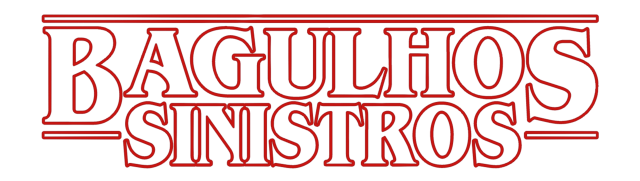
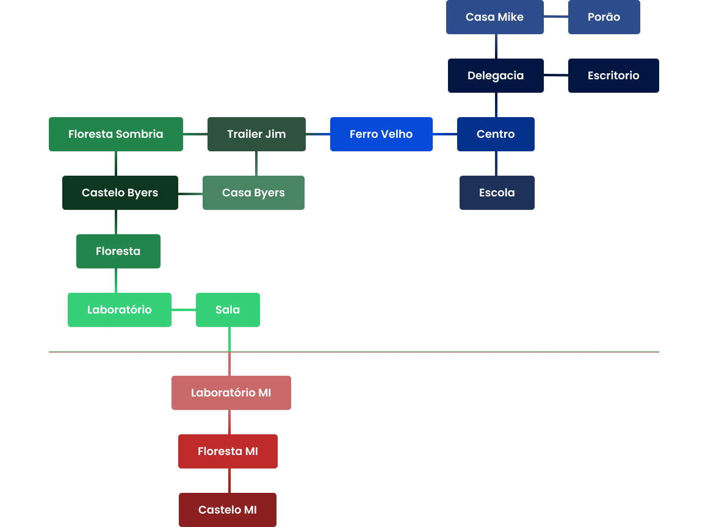

  <a bref="#sobre" style="font-weight: 600; color: #D90B0B">Sobre o Jogo</a> • 
   <a bref="#mapa" style="font-weight: 600; color: #D90B0B">Mapa</a> • 
  <a bref="#jogabilidade" style="font-weight: 600; color: #D90B0B">Jogabilidade</a> • 
  <a bref="#tecnologia" style="font-weight: 600; color: #D90B0B">Tecnologia</a> • 
  <a bref="#trabalho" style="font-weight: 600; color: #D90B0B">Trabalho</a> • 
  <a bref="#autores" style="font-weight: 600; color: #D90B0B">Autores</a> • 
  <a bref="#licenca" style="font-weight: 600; color: #D90B0B">Licença</a> 

 
<h1 id="sobre" style="font-weight: 600; color: #A60D1A" > 🕹️ Sobre o Jogo </h1>

### História:

Após o sumiço de Will Byers, um menino de 12 anos, o delegado Jim Hopper inicia uma investigação para encontrá-lo na cidade de Hawkins, e ele irá desvendar mistérios, com criaturas monstruosas e dimensões paralelas.

### Objetivo:

Encontrar Will Byers no Mundo Invertido.

### Jogador Principal:

Jim Hopper.

### Personagem Secundários:

Joyce Byers, Will Byers, Eleven, Crianças (Mike, Lucas, Dustin), Adolescentes (Nancy, Jonathan, Steve).

### Missão:

Na investigação, deverá ser analisado alguns itens para que descubra onde está o Will.

1. O desenho irá ser uma pista de onde o Will está
2. A bicicleta irá mostrar que o Will estava perto do Laboratório
3. As luzes do pisca-pisca na casa da Joyce irá indicar que eles está no Mundo Invertido

Com a análise dessas 3 pistas, será liberado a passagem para o mundo invertido.

### Game Over:

70 movimentos.

### Armazenamento:

Coldre do Jim Hopper.

### Limite do armazenamento:

3 tipos de itens.

### Gênero:

RPG Investigação Sobrenatural.

 
<h1 id="mapa" style="font-weight: 600; color: #A60D1A">
🗺️ Mapa
</h1>

 

 
<h1 id="jogabilidade" style="font-weight: 600; color: #A60D1A">
🖥️ Jogabilidade
</h1>

<table style="width:100%">
  <tr>
    <th>Ambiente</th>
    <th>Itens</th>
    <th>Ação</th>
    <th>Personagens</th>
    <th>Direções</th>
  </tr>
  <tr>
    <td>Centro</td>
    <td>-</td>
    <td>-</td>
    <td>-</td>
    <td>
      Esquerda: Ferro Velho  
      Frente: Escola  
      Trás: Delegacia
    </td>
  </tr>
  <tr>
    <td>Delegacia</td>
    <td>Chave</td>
    <td>Usar chave</td>
    <td>-</td>
    <td>
      Corredor: Escritório  
      Trás: Casa Mike
    </td>
  </tr>
  <tr>
    <td>Escritório</td>
    <td>Balas</td>
    <td>
      Usar chave  
      Pegar balas
    </td>
    <td>-</td>
    <td>Corredor: Delegacia</td>
  </tr>
  <tr>
    <td>Escola</td>
    <td>Desenho</td>
    <td>Analisar desenho</td>
    <td>Adolescentes</td>
    <td>Trás: Centro</td>
  </tr>
  <tr>
    <td>Ferro Velho</td>
    <td>Alicate</td>
    <td>Pegar alicate</td>
    <td>Crianças</td>
    <td>
      Direita: Centro  
      Esquerda: Trailer Jim 
    </td>
  </tr>
  <tr>
    <td>Casa Mike</td>
    <td>-</td>
    <td>-</td>
    <td>-</td>
    <td>Escada: Porão</td>
  </tr>
   <tr>
    <td>Porão</td>
    <td>Lanterna</td>
    <td>Pegar lanterna</td>
    <td>Eleven</td>
    <td>Escada: Casa Mike</td>
  </tr>
   <tr>
    <td>Trailer Jim</td>
    <td>
      Arma  
      Balas
    </td>
    <td>
      Pegar arma  
      Pegar balas  
    </td>
    <td>-</td>
    <td>
      Direta: Ferro Velho  
      Esquerda: Floresta Sombria  
      Frente: Casa Byers  
    </td>
  </tr>
   <tr>
    <td>Floresta Sombria</td>
    <td>Bicicleta</td>
    <td>Analisar bicicleta</td>
    <td>-</td>
    <td>
      Direta: Trailer Jim  
      Frente: Castelo Byers  
    </td>
  </tr>
  <tr>
    <td>Casa Byers</td>
    <td>Pisca-Pisca</td>
    <td>Analisar Pisca-Pisca</td>
    <td>Joyce</td>
    <td>
      Trás: Trailer Jim  
      Esquerda: Castelo Byers  
    </td>
  </tr>
  <tr>
    <td>Castelo Byers</td>
    <td>-</td>
    <td>-</td>
    <td>-</td>
    <td>
      Trás: Floresta Sombria  
      Direita: Casa Byers  
      Frente: Floresta Sombria Fundo 
    </td>
  </tr>
  <tr>
    <td>Floresta Sombria (Fundo)</td>
    <td>-</td>
    <td>Usar alicate</td>
    <td>-</td>
    <td>
      Trás: Castelo Byers  
      Frente: Laboratório 
    </td>
  </tr>
  <tr>
    <td>Laboratório</td>
    <td>-</td>
    <td>-</td>
    <td>-</td>
    <td>Escada: Sala</td>
  </tr>
  <tr>
    <td>Sala</td>
    <td>-</td>
    <td>-</td>
    <td>-</td>
    <td>
      Escada: Laboratório  
      Portal: Laboratório - Mundo Invertido  
    </td>
  </tr>
  <tr>
    <td>Laboratório - Mundo Invertido</td>
    <td>-</td>
    <td>Usar lanterna</td>
    <td>-</td>
    <td>
      Portal: Sala   
      Frente: Floresta Sombria - Mundo Invertido 
    </td>
  </tr>
  <tr>
    <td>Floresta Sombria - Mundo Invertido</td>
    <td>-</td>
    <td>Usar lanterna</td>
    <td>Demogorgon</td>
    <td>
      Trás: Laboratório - Mundo Invertido    
      Frente: Castelo Byers - Mundo Invertido 
    </td>
  </tr>
  <tr>
    <td>Castelo Byers - Mundo Invertido</td>
    <td>-</td>
    <td>Usar lanterna</td>
    <td>Will Byers</td>
    <td>Trás: Laboratório - Mundo Invertido</td>
  </tr>
</table>

### Ambientes:

- Centro
  - Delegacia de Polícia de Hawkins
    Escritório do delagado
  - Escola de Hawkins
- Ferro Velho
- Casa do Mike
  - Porão da casa
- Trailer do Hopper
- Floresta Sombria
- Casa dos Byers
- Castelo Byers
- Floresta Sombria Fundo
- Laboratório Nacional de Hawkins
  - Sala com portal par ao Mundo Invertido
- Mundo Invertido
  - Laboratório
  - Floresta
  - Castelo Byers

### Direções:

- Direita
- Esquerda
- Frente
- Trás
- Portal
- Corredor
- Elevador

### Itens:

#### Coletáveis:

- Chave
- Arma
- Bala
- Lanterna
- Alicate

#### Não coletáveis (Pistas):

- Desenho
- Bicicleta Will
- Pisca-Pisca

#### Ações:

- Usar
  - Alicate
  - Chave
  - Lanterna
- Analisar
  - Desenho
  - Bicicleta
  - Pisca-Pisca
- Atacar Inimigo
  - Arma + Bala

### Palavras de Comando:

- Ir
- Ajuda
- Sair
- Observar
- Pegar
- Largar
- Usar
- Analisar
- Atacar Inimigo

---

 
<h1 id="tecnologias" style="font-weight: 600; color: #A60D1A">
🛠️ Tecnologias
</h1>

<table border-collapse=collapse>
  <tr>
    <td></td>
    <td><a href="https://docs.oracle.com/en/java/" target="_blank">Java</a></td>
  </tr>
  <tr>
    <td></td>
    <td><a href="https://code.visualstudio.com/" target="_blank">VSCode</a></td>
  </tr>
</table>

 
<h1 id="trabalho" style="font-weight: 600; color: #A60D1A">
📚 Trabalho
</h1>

Trabalho Prático da disciplina de Prática de Programação Orientada a Objetos da Universidade Federal de Lavras (UFLA), lecionada pelo professor Julio Cesar Alves.

<h1 id="autores" style="font-weight: 600; color: #A60D1A">
👥 Autores
</h1>

<table style="width: 100%;">
  <tr>
    <td style="padding: 16px;">
      
    </td>
    <td style="padding: 16px;">
      
    </td>
    <td style="padding: 16px;">
      
    </td>
    <td style="padding: 16px;">
      
    </td>
  </tr>
  <tr>
    <td style="text-align: center;">Ana Torres</td>
    <td style="text-align: center;">Ingrid Falchi</td>
    <td style="text-align: center;">Larissa Narciso</td>
    <td style="text-align: center;">Samuel Ferreira</td>
  </tr>
</table>

 
<h1 id="licenca" style="font-weight: 600; color: #A60D1A">
📜 Licença
</h1>

O projeto publicado em 2022 sobre a licença MIT.

